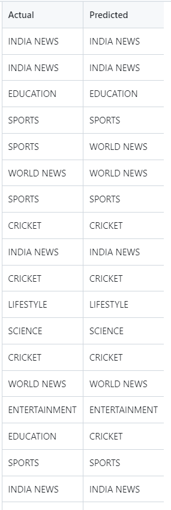
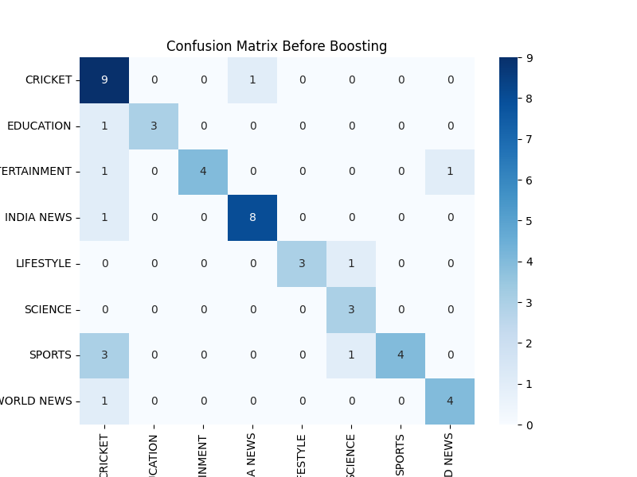
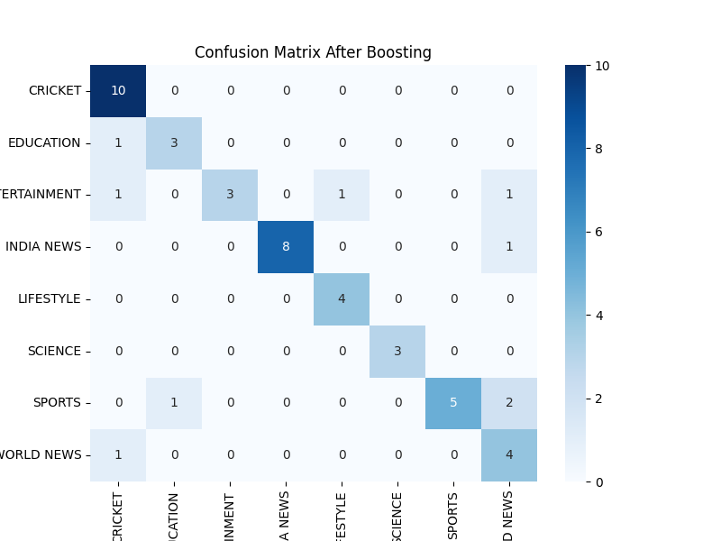

<div align="center">
  <h1>Webscrape.io</h1>
  <h3>The Best News Scrapper to categorise News Articles!</h3>
</div>

<p align="center">
  <a href="/scaped_data/classified_articles_data.csv">Obtained Dataset</a> &#xa0; | &#xa0;
  <a href="/scaped_data/scrape.py">Web Scrapping Code</a> &#xa0; | &#xa0;
  <a href="/model/model.ipynb">Jupyter Notebook</a> &#xa0; 
</p>

## About ##

This project aims to scrape a news article website to collect the articles with their links, then classify the articles using Text Classification model(s) based on their categories from the [News Website](https://www.hindustantimes.com).


## Instructions 
1. **Install the requirements:** ```pip install -r requirements.txt``` <br>
2. Run the [`scrape.py`](/scaped_data/scrape.py) for scrapping the Articles from [News Website](https://www.hindustantimes.com). <br>
3. The obtained dataset will be released after web scraping from there use [`model.ipynb`](/model/model.ipynb) for classifying the articles in different categories.
4. Testing the model using pickle file `trained_model.pkl` and loading in [`test_model.ipynb`](/model/test_model.ipynb) file .

<h2> Results & Observations</h2>
<div align="center"> </div>
<div align="center"> <ACCURACY before Hypertunning: 78%/> 
                     <ACCURACY after Hypertunning: 82%/> 
<div align="center" id="top">
  
    
  

</div>


<h4 align = "left"> Contributors </h2>
<p align="left">
  <a href="https://github.com/krishnaa-tech">Krish Goyal</a> &#xa0;
</p>
